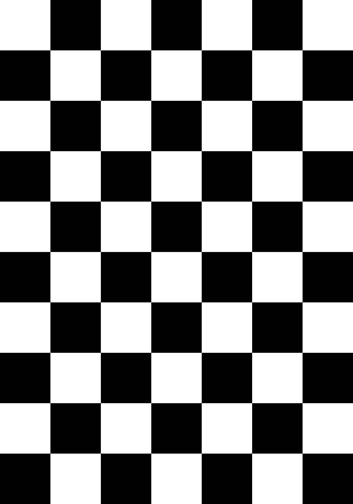

# Checkerboard Camera Calibration (OpenCV)

This repository contains a Python script to estimate camera intrinsics **fx, fy, cx, cy** and distortion coefficients from images (or sampled video frames) of a printed checkerboard.

The script uses OpenCV’s `calibrateCamera` and supports both **image glob inputs** and **video inputs**. A text report is written to disk with all results, including the intrinsic matrix **K** and the mean reprojection error.

---

## Features

- Uses a standard **planar checkerboard** (black & white squares).
- Accepts **multiple images** via glob (e.g., `data/*.jpg`) or **samples frames** from a video.
- Outputs:
  - Intrinsic matrix **K**
  - Distortion coefficients (**k1, k2, p1, p2, k3, k4, k5, k6** when `CALIB_RATIONAL_MODEL` is enabled)
  - Mean reprojection error (in pixels)
  - Optional undistorted image previews
- Works on Windows / macOS / Linux.

---

## Requirements

- Python 3.8+
- OpenCV (e.g., `pip install opencv-python`)
- NumPy (e.g., `pip install numpy`)

> If you use a virtual environment, make sure the interpreter used by your shell is the one with OpenCV installed.

---

## Printing the Checkerboard

- Default assumptions in the script:
  - **Inner corners**: `--nx 9 --ny 6` (this corresponds to a 10×7 **squares** board).
  - **Square size**: `--square_size_mm 25` (used only for metric scaling; intrinsics do not require an absolute scale).
- Print a crisp, high-contrast checkerboard. Ensure it is **flat** during capture.
- Capture **10–20+** images at varied distances, tilts, and positions (center and corners of the frame).

> If you need a printable board, you can generate one externally or with a small script. The calibration in pixels does not depend on the physical size, but reporting in mm will reflect the `--square_size_mm` value.

---

## Usage

### 1) Calibrate from a set of images

**Folder structure example**
```
project/
├─ calibrate_checkerboard.py
└─ data/
   ├─ img001.jpg
   ├─ img002.jpg
   └─ img003.jpg
```

**Run (Linux/macOS – Bash):**
```bash
python calibrate_checkerboard.py   --images_glob "data/*.jpg"   --nx 9 --ny 6   --square_size_mm 25   --save_dir calib_output   --save_undistorted
```

**Run (Windows – PowerShell):**
```powershell
python calibrate_checkerboard.py `
  --images_glob "data/*.jpg" `
  --nx 9 --ny 6 `
  --square_size_mm 25 `
  --save_dir calib_output `
  --save_undistorted
```

> **Note:** PowerShell does **not** support Bash-style `\` line continuations. Use backticks (`` ` ``) or enter the command on one line:
> ```powershell
> python calibrate_checkerboard.py --images_glob "data/*.jpg" --nx 9 --ny 6 --square_size_mm 25 --save_dir calib_output --save_undistorted
> ```

### 2) Calibrate from a video

The script can sample frames periodically from a video file and calibrate on those frames:
```bash
python calibrate_checkerboard.py   --video path/to/video.mp4   --video_out_dir calib_frames   --video_max_frames 40   --video_skip 10   --nx 9 --ny 6   --square_size_mm 25   --save_dir calib_output   --save_undistorted
```

- `--video_skip 10` means: keep 1 out of every 10 frames.
- Extracted frames are saved to `--video_out_dir` and then used for calibration.

---

## Output

- `calib_output/calibration_report.txt` includes:
  - Image size (width, height)
  - Number of frames used (valid checkerboard detections)
  - RMS from OpenCV’s `calibrateCamera`
  - Mean reprojection error (px)
  - **K** (intrinsic matrix)
  - Distortion coefficients
  - **fx, fy, cx, cy** in pixels
- If `--save_undistorted` is set, a few undistorted previews are saved in `calib_output/undistorted/`.

---

## Tips for Accurate Calibration

- Use images with **sharp** corners (avoid blur; increase shutter speed/lighting).
- Cover a range of **viewpoints**: near/far, left/right, up/down, rotated.
- Make sure the board occupies different regions of the image, including **corners**.
- Avoid strong reflections on the board (use matte paper if possible).

---

## Troubleshooting

### 1) “No images found.”
- Check the glob:
  - Windows PowerShell: `"data/*.jpg"` is correct.
  - Ensure the images are actually in the `data/` folder and have the `.jpg` extension (not `.jpeg` or `.HEIC`).

### 2) “Not enough valid detections: got X frames; need >=5.”
- Provide at least **5** valid images where the checkerboard was detected (ideally 10–20+).
- Ensure the checkerboard is fully visible and corners are not too small or too large.
- Try toggling the flag combination in `cv2.findChessboardCorners` if needed.

### 3) Distorted or fisheye lenses
- This script uses the standard pinhole + rational distortion model. For strong fisheye lenses, consider OpenCV’s **fisheye** module (`cv2.fisheye.calibrate`).

---

## Parameters

- `--images_glob`: Glob for input images (e.g., `"data/*.jpg"`).
- `--video`: Path to a video to sample frames from.
- `--video_out_dir`: Where sampled frames are saved.
- `--video_max_frames`: Maximum number of frames to sample.
- `--video_skip`: Keep 1 of every N frames.
- `--nx`, `--ny`: **Inner corner counts** (columns, rows). For a board with 10×7 squares, use `9×6` inner corners.
- `--square_size_mm`: Physical size of one square in millimeters (informational; intrinsics are in pixels).
- `--show`: Show detected corners during processing.
- `--save_undistorted`: Save sample undistorted images.
- `--save_dir`: Output directory for the report and images.
